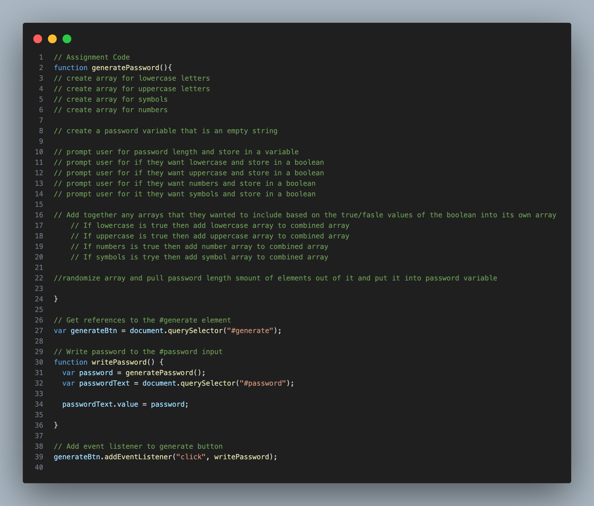

## Password Generator

These are the directions given:
- AS AN employee with access to sensitive data
I WANT to randomly generate a password that meets certain criteria
SO THAT I can create a strong password that provides greater security

As a result the password generator will have the follwing attributes:
- WHEN I click the button to generate a password
THEN I am presented with a series of prompts for password criteria
- WHEN prompted for password criteria
THEN I select which criteria to include in the password
- WHEN prompted for the length of the password
THEN I choose a length of at least 8 characters and no more than 128 characters
- WHEN asked for character types to include in the password
THEN I confirm whether or not to include lowercase, uppercase, numeric, and/or special characters
- WHEN I answer each prompt
THEN my input should be validated and at least one character type should be selected
- WHEN all prompts are answered
THEN a password is generated that matches the selected criteria
- WHEN the password is generated
THEN the password is either displayed in an alert or written to the page

## Starter Code 

- Starter code included HTML and CSS files that, once linked, created the style and content of the generator. It also included a general JavaScript outline.
- The CSS and JavaScript files had to be linked to the HTML with the new location for this repository.
- Initial pseudocode was written in the JavaScript file to map out the functions necessary to complete this challenge. See Below. 

## JavaScript 

## Installation

## Usage

## Author

* [schneidsmc](https://github.com/schneidsmc)